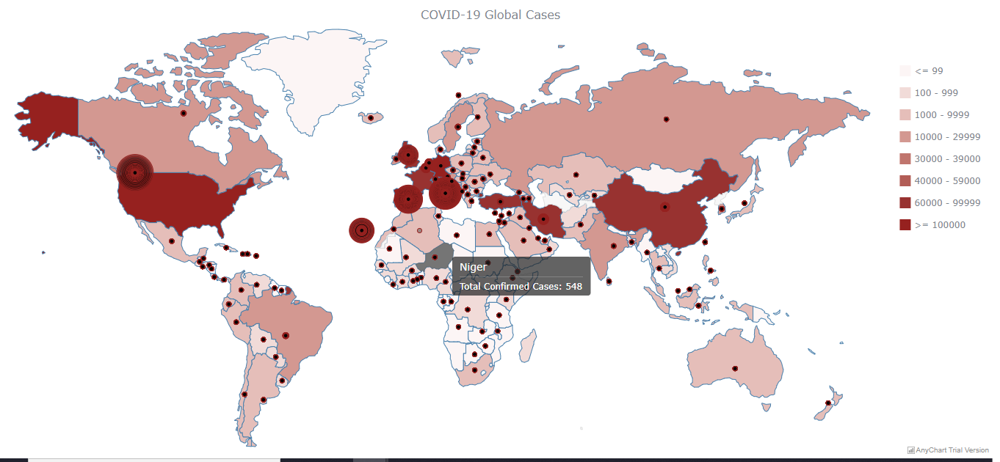

## Breve Introdução

Este documento surgiu depois que tive um desafio na empresa que prestava serviços no front, onde o interesse era inserir um gráfico de mapeamento de acessos de usuários em uma determinada área geográfica.

A princípio a ideia era capturar os acessos de clientes de um portal na região do Brasil, por meio de um simples código usando o geolocation fornecido pelo próprío equipamento do usuário.

Depois de muitas pesquisas cheguei a esse site [ED RODRIGUES](https://edrodrigues.com.br/blog/criando-a-visualizacao-de-dados-de-mapas-de-choropleth-usando-javascript-no-covid-19-stats/) em que há um passo-a-passo bem legal que pode facilmente ser entendido.

## Recomendações usadas no projeto.

Durante a leitura do tutorial foi recomendado baixar os módulos via [CDN](https://www.anychart.com/download/cdn/?v=8.10.0):

1. Bibliotecas
    - [AnyMap](https://www.anychart.com/products/anymap/overview/) do AnyChart = projetada especificamente para produzir mapas. Essa biblioteca é leve, simples e fácil de começar. Possui uma vasta [documentação](https://docs.anychart.com/Maps/Quick_Start).
    - [Proj4.js](https://github.com/proj4js/proj4js/) = é uma biblioteca JavaScript para transformar coordenadas de ponto de um sistema de coordenadas para outro, incluindo transformações de datum.		
	
2. Módulos
    - [Core](https://cdn.anychart.com/releases/8.7.1/js/anychart-core.min.js) = módulo básico necessário para usar qualquer outro módulo.
    - [Mapas geográficos](https://cdn.anychart.com/releases/8.7.1/js/anychart-map.min.js) = contém as informações necessárias para criar gráficos de mapas geográficos.
    - [Dados geográficos](https://cdn.anychart.com/releases/8.7.1/geodata/custom/world/world.js) = contém informações sobre as localizações geográficas.
    - [Data Adapter](https://cdn.anychart.com/releases/8.7.1/js/anychart-data-adapter.min.js) = será usado como um módulo auxiliar para carregar dados do arquivo JSON.

3. Dados que serão carregados.
    - Para obter os dados, escrevi o código num arquivo js que chamei de **config-graphic.js**.
      ```   
        anychart.data.loadJsonFile ("https://static.anychart.com/git-storage/word-press/data/choropleth-map-tutorial/data.json", function (data) {
            console.log(data);
        });
      ```   
4. Amostra de como será apresentado o projeto:
    [](https://edrodrigues.com.br/blog/criando-a-visualizacao-de-dados-de-mapas-de-choropleth-usando-javascript-no-covid-19-stats/)
    
Caso tenha interesse em saber mais sobre esse projeto, ou entrar em contato comigo caso surgir alguma dúvida, você também pode seguir o tutorial, segue os links abaixo:
- [Site do tutorial](https://edrodrigues.com.br/blog/criando-a-visualizacao-de-dados-de-mapas-de-choropleth-usando-javascript-no-covid-19-stats/).
- Conversar pelo [LinkedIn](https://www.linkedin.com/in/jaisondallabrida).
- Conversar pelo [Whatsapp ](https://api.whatsapp.com/send?phone=5547996612896&text=Ol%C3%A1%2C%20Jaison!%20Eu%20li%20sobre%20o%20seu%20projeto%20do%20GitHub%20e%20gostaria%20de%20trocar%20uma%20ideia.).
